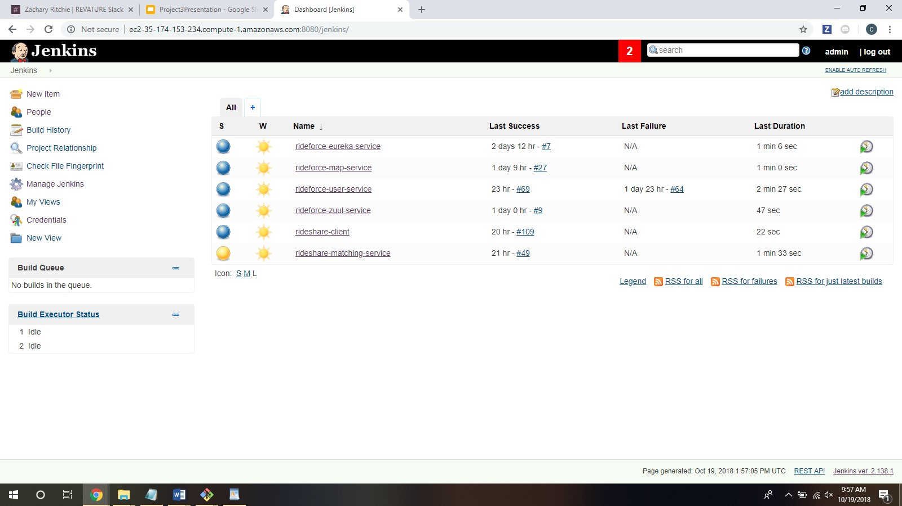
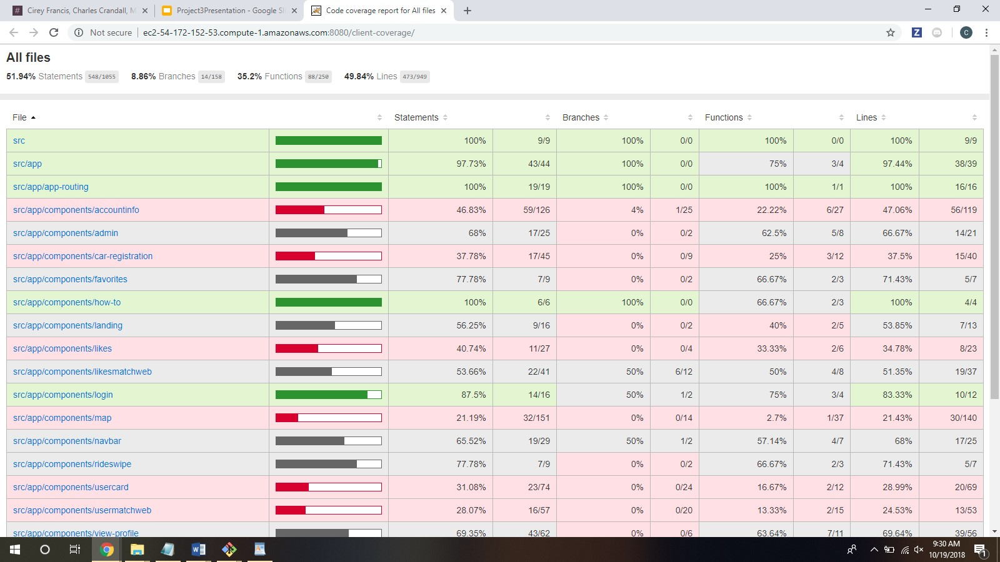
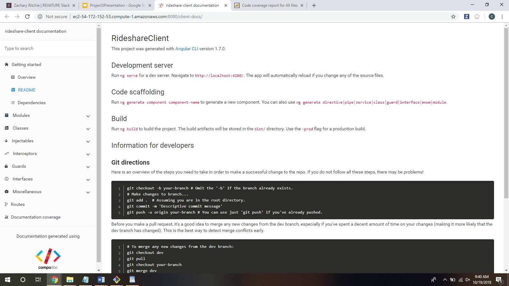
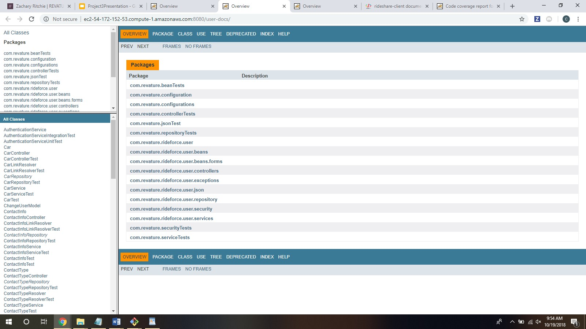

# Project 3: Rideforce
Rideforce is an application for matching drivers and riders together for carpooling.

# Links (Pictures Below)
Associated Github Repos:
https://github.com/revaturelabs?utf8=%E2%9C%93&q=rideshare&type=&language=

Hosted Client-side Test Coverage: 
http://ec2-54-172-152-53.compute-1.amazonaws.com:8080/client-coverage/

Hosted Client-side Documentation:
http://ec2-54-172-152-53.compute-1.amazonaws.com:8080/client-docs/

Hosted Back-end Documentation for Different Services
http://ec2-54-172-152-53.compute-1.amazonaws.com:8080/user-docs/
http://ec2-54-172-152-53.compute-1.amazonaws.com:8080/matching-docs/
http://ec2-54-172-152-53.compute-1.amazonaws.com:8080/maps-docs/

# Tech Stack
 + Used __Amazon EC2__ to run and deploy our server-side code.
 + Used __Jenkins__ to create CI/CD pipelines.
 + Used __Amazon S3__ for storing static websites.
 + Used __Eureka__ to discover our microservices.
 + Used __Slack__ to automatically notify developers how stable the build was after they pulled into 
the dev and master branches.

Worked on DevOps with Jenkins, Maven, Tomcat, Github...
Microservices, Docker

Separate Dev and Master pipelines.

## Jenkins - Master:

## Client-side Test Coverage:

## Client-side Documentation:

## Back-end Documentation:

